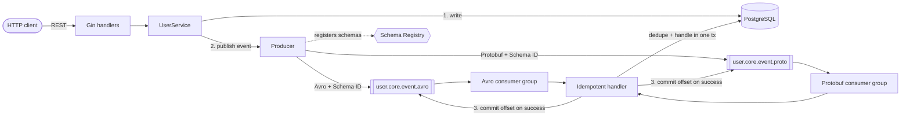

# kafka-user-service

[](https://github.com/tommitoan/kafka-user-service/actions/workflows/ci.yml)

[](LICENSE)

A Go user-management REST API that publishes every change as an event to Kafka, in **both Avro and
Protobuf**, validated against **Confluent Schema Registry**, and consumes those events back with
**manual offset commits** and **consumer-side idempotency**.

It is a compact, runnable reference for the parts of an event-driven service that usually go wrong:
what happens on redelivery, on a failed handler, on a crash between processing and commit.

## Architecture



## What it demonstrates

| Concern | How it is handled |
|---|---|
| **Schema governance** | Avro and Protobuf schemas are registered at startup; every payload carries its schema ID in the Confluent wire format. The `.avsc` / `.proto` files are the single source of truth (embedded, not copied into code). |
| **Real Protobuf** | `proto/user_event.pb.go` is generated by `protoc-gen-go`; payloads are binary Protobuf with Confluent's message-index framing, not JSON. |
| **At-least-once delivery** | The consumer uses `FetchMessage` + `CommitMessages` with auto-commit disabled. An offset is committed only after the handler returns successfully. |
| **Idempotent consumption** | Each event has a stable `event_id`. The handler inserts `(consumer_group, topic, event_id)` into `processed_events` and runs the business handler **in the same DB transaction**, so a failed handler rolls the marker back and a redelivery is retried, not skipped. |
| **Ordering** | Messages are keyed by user ID with a hash balancer, so all events of one user land on one partition in order. |
| **Backward-compatible schemas** | `event_id` was added with a default, so messages written before it existed still decode. |
| **Topic provisioning** | Topics are declared in `config.yaml` and created on startup. |
| **Operational hygiene** | Structured logging (`slog`), graceful shutdown that drains consumers, migrations on boot, no internal error details in HTTP responses. |

## Quick start

Requires Docker and Go 1.25+.

```bash
make up      # Kafka (KRaft), Schema Registry, Kafka UI, Postgres
make run     # start the service on :8085
```

Or run everything, service included, in containers:

```bash
make demo
```

| URL | What |
|---|---|
| http://localhost:8085/ | Small web UI to create, edit and delete users |
| http://localhost:8085/swagger/index.html | OpenAPI / Swagger UI |
| http://localhost:9090 | Kafka UI: browse topics, messages and schemas |

Create a user and watch the event arrive on both topics:

```bash
curl -s -X POST localhost:8085/api/v1/users \
  -H 'Content-Type: application/json' \
  -d '{"name":"Alice","email":"alice@example.com","age":30}'
```

Stop and clean up with `make down`. Host ports can be changed with `KAFKA_PORT`,
`SCHEMA_REGISTRY_PORT`, `KAFKA_UI_PORT`, `POSTGRES_PORT` and `APP_PORT` if they collide with
something already running.

## API

| Method | Path | Success | Errors |
|---|---|---|---|
| `POST` | `/api/v1/users` | `201` | `400` invalid body, `409` email already in use |
| `GET` | `/api/v1/users` | `200` (`offset`, `limit` ≤ 100) | `400` non-numeric paging |
| `GET` | `/api/v1/users/{id}` | `200` | `400` bad UUID, `404` |
| `PUT` | `/api/v1/users/{id}` | `200` partial update | `400`, `404`, `409` |
| `DELETE` | `/api/v1/users/{id}` | `204` soft delete | `400`, `404` |
| `GET` | `/health` | `200` | |

`PUT` is a partial update: fields you omit are left alone, and `{"age": 0}` really sets the age to 0.
Unexpected failures return a generic `500`; details go to the log only.

## Event contract

| | Avro topic | Protobuf topic |
|---|---|---|
| Name | `com.br4.user.core.event.avro` | `com.br4.user.core.event.proto` |
| Schema subject | `<topic>-value` | `<topic>-value` |
| Schema file | [`schemas/avro/user_event.avsc`](schemas/avro/user_event.avsc) | [`proto/user_event.proto`](proto/user_event.proto) |
| Key | user UUID | user UUID |
| Consumer group | `user-service-avro` | `user-service-proto` |

Payload layout: `[0x00][4-byte schema ID]` followed by the Avro record, or, for Protobuf, by the
message-index byte `0x00` and the serialized message. `event_type` is `CREATED`, `UPDATED` or
`DELETED`. `event_id` is a UUID generated once per logical event and is identical on both topics.

## Delivery semantics and known limitations

This service is **at-least-once with idempotent consumers**. It does not claim exactly-once
semantics end to end. Be aware of these gaps:

- **Dual write, no outbox.** The service commits to Postgres and then publishes. If Kafka is down
  at that moment the change is stored but the event is lost (the failure is logged). The fix is a
  transactional outbox, see the roadmap.
- **No dead-letter queue.** A message that cannot be decoded or handled is not committed and is
  skipped for the rest of the process; it is re-read after a restart. A poison message therefore
  repeats on every restart until a DLQ exists.
- **Two topic writes are not atomic.** The Avro write can succeed while the Protobuf write fails.
  Consumers dedupe on `event_id`, so retrying the whole publish is safe.
- **Offsets and the dedup table are separate stores.** A crash after the DB commit but before the
  Kafka commit causes a redelivery, which the idempotency check absorbs.

## Testing

```bash
make test               # unit tests, race detector on
make test-integration   # HTTP stack + idempotency + SQL migrations on embedded Postgres, no Docker
make lint               # go vet, staticcheck (if installed), gofmt
```

| Layer | What is covered |
|---|---|
| Unit | Service rules, HTTP contract and status mapping, config loading, Avro and Protobuf codecs (round trips, wire format, legacy schema), the consume loop (commit only after success, bad message, fetch errors) |
| Integration | CRUD through the real repository on Postgres, duplicate-email handling, the idempotent handler (dedupe, per-topic independence, missing `event_id`, rollback on handler failure), and the SQL migrations themselves |

The Kafka path was also smoke-tested manually against the compose stack (create, update, delete,
both consumers, registry subjects). Automated broker-level tests are on the roadmap.

## Project layout

```text
cmd/server/            entry point and wiring
internal/api/          Gin handlers, web UI, OpenAPI annotations
internal/service/      business rules and event publishing
internal/repository/   GORM persistence, maps DB errors to domain errors
internal/kafka/        producer, consumer loop, wire-format codecs, idempotent handler, topic admin
internal/config/       Viper configuration (file + APP_* env overrides)
internal/db/           connection and migration runner
migrations/            SQL migrations (golang-migrate)
schemas/, proto/       Avro and Protobuf contracts
docs/                  generated OpenAPI spec and design notes (docs/orchestrator)
test/integration/      integration tests (build tag `integration`)
```

## Configuration

Precedence: environment variables (`APP_` prefix, dots become underscores, e.g.
`APP_DATABASE_HOST=db`), then `config.yaml`, then built-in defaults. Topics and their partition
counts are listed under `kafka.topics`.

## Development

```bash
make help        # all targets
make swagger     # regenerate docs/ from handler annotations
make proto-gen   # regenerate proto/user_event.pb.go (needs protoc and protoc-gen-go)
```

## Roadmap

1. Dead-letter topic with bounded retries ([spec](docs/orchestrator/06-dlq-spec.md))
2. Transactional outbox for the HTTP → DB → Kafka path ([notes](docs/orchestrator/07-outbox-vs-transaction-demo.md))
3. Broker-level end-to-end tests with Testcontainers

## License

[MIT](LICENSE)
